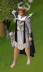
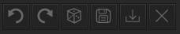
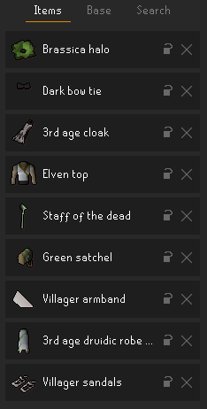
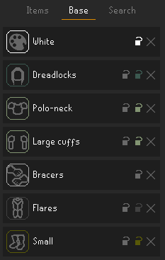
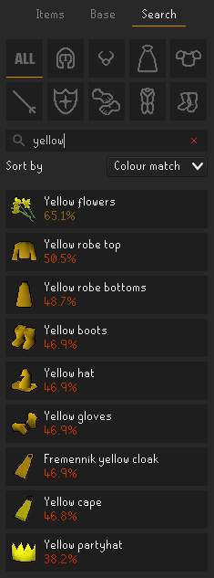

# Fashionscape

Docs for version: ***1.1.7***

Ever spend countless hours on a grind for an untradeable item, only to realize that it doesn't look good with literally 
any other item in the game? This plugin was made for you. It allows anyone to preview combinations of equipment to 
plan out the perfect look quickly and efficiently.

***disclaimer:*** this plugin isn't intended to be on all the time. It's recommended to turn it off during combat since
the animations will be wrong, and the swapped items might distract. I'm not responsible for any stupid mistakes
that result from leaving the plugin on when you should have turned it off.

## User guide
All the UI lives in a dedicated side panel. If the plugin is on, you'll find it near the bottom of the list
(beneath notes). Look for the dress form:
 

The panel has a row of button controls, and below it, three tabs: outfit, base, and search. 

#### Top controls
The buttons are, in order from left to right:
* Undo and redo last action (these are only enabled if you can perform them)
* A randomizer (dice) button that randomly assigns items to all your unlocked slots. The randomizer has an 
"intelligence" setting in the plugin config, which when set to anything other than `NONE`, will utilize the colour match
algorithm to provide results.
* Save and load buttons, which work with .txt files placed in the RuneLite folder, under `/outfits/`. You can open the
outfit folder in your system file browser by **right-clicking either save or load**. Note that you can't save empty outfits,
and anything you're actually wearing in-game isn't saved.
* Clear button, which undoes everything you're wearing with the plugin, **including** locked slots. If you want to erase
everything *except* locked slots, there's a right-click option to soft clear.

#### Items tab
"Items" shows every item you're wearing via the plugin. Note that certain slots, like ammo, are not shown because no
items equipped in those slots change your appearance. Each item shows an icon that can be clicked to bring up a search
for new items in that slot. You can also "lock" and clear out each slot with the controls on the right (see 
"lock mechanics" for more on locks). If nothing is set in a slot, it will display **"Not set"** and will display whatever
your character is actually wearing. If you'd like to override what you're wearing to display nothing, this is possible
by selecting **"Nothing"** in the search results (note: this is only possible for certain items).

#### Base tab
"Base" is similar to "items", only this tab allows changing your character's base models and colors, essentially 
combining every makeover NPC into one. There is a jaw (or beard) slot that is only available to male characters, while 
every other slot is available to either gender. The icons in this tab have a rounded border indicating the color you've 
swapped to (if you haven't changed the color, it will show up as light gray). Note that torso+arms and hair+jaw slot 
colors are connected, so changing one always changes the other. There is no search feature for these slots since there 
not as many options; instead, **clicking the icon** brings up a dropdown to browse the color/model options available.

#### Search tab
Here you can search for equipment to try on. Leaving the search bar empty will show all the results for a selected
slot (except the "all" tab, where too many results would be displayed). The results will update as you type. Hovering
over an item will show a preview of what it looks like on your character. When clicked, the item will update and will
display as part of your outfit. If the item is already worn, clicking it again removes it.

There are three sorting options: 
* Release, which roughly orders results by release date (it actually just goes by item IDs; close enough)
* Alphabetical, pretty self-explanatory
* Colour match, which uses aggregated, area-weighted Euclidean colour distances of the "best-matching" colours for 
that result compared to the colours of all the items currently worn (excluding the slot you're currently browsing). 
With this option selected, you can also see the colour-coded percent match for that item.

#### Lock mechanics
You can "lock" individual slots with the lock icon next to the x button for each slot in the "items" and "base" panels
(some base slots have two locks: model and color, in that order, with the color lock matching the current slot color).
This prevents that slot from being cleared by the randomizer and the undo/redo function.
Clicking the lock again will unlock it. The locking feature is designed to work with the randomizer: as you find pieces 
that work together, you can lock them and randomize the remaining slots. Note that locking a base model will always 
lock the corresponding item slot, and unlocking an item slot will always unlock the base model. However, you can be in
a state where the item slot is locked while the base slot is unlocked.

  
Neat things you can do with locks:

  
* Lock the shield slot and randomize with weapons unlocked. All weapon results will be one-handed.
* Lock your player's hair/beard with the head item unlocked and randomize. All the head slot results will not obscure 
your hair and/or beard. A similar approach can be used on the player's arms model and the torso item slot.
* Lock the torso, legs, and/or boots item slots while leaving the base models unlocked. The randomizer will now scramble
your base models for those slots.
 

#### Configuration

There are a bunch of items in the game which are either restricted to certain activities/events or are unobtainable 
without hacking the game. These can be hidden from the plugin's search results and the randomizer by checking **"exclude
non-standard items"**.

The randomizer has a few **"intelligence"** settings. Higher intelligence means the randomizer results will yield items
that are similar in color. Lower intelligence settings are computationally faster.

There is a right-click option to **"copy-outfit"** on other players, which imports their entire look on your character,
including items, colors, and (if your genders match) base models. Since many other plugins provide player menu entries,
this feature can be toggled off.

## FAQ
Q: Isn't this hacking? Am I gonna get banned?

A: Your appearance only changes client-side; other players can't see your outfits. Using this plugin is not 
functionally affecting the game for you, it's no different from using resource packs to reskin the game's base UI.

Q: Why is it changing my character's arms / (facial) hair?

A: The client has no way of telling what your character's base models look like unless you reveal them, so 
it's using some default models. The easiest fix is to un-equip your head- and torso-slot items. You can re-equip your
items after doing this, and after you've done it once on your account, it shouldn't happen again.

Q: My animations mess up when I equip (...). Why?

Idle animations are currently the only scenario supported for now (after all, real fashionscapers are usually idle).
There's not an automated way to tell which animation to use for which weapon, so unless your idle animation is wrong, 
it's probably not going to be fixed anytime soon.

Q: Such-and-such item isn't showing up or looks janky, why?

If you notice some items look buggy or don't have the correct idle animation, please let me know by saving the outfit
and uploading / pasting the text so that I can mark that item ID appropriately. I try to keep up with newly-released
items, but this also depends on other factors (for example, an item's slot is determined by the RuneLite wiki scraper). 

Feature suggestions, bug reports, and pull requests are all welcome. Please keep in mind that this plugin is intended
to be a tool for discovery and planning, and features that extend beyond that will probably not be implemented.
