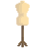
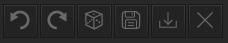
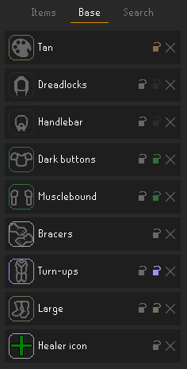
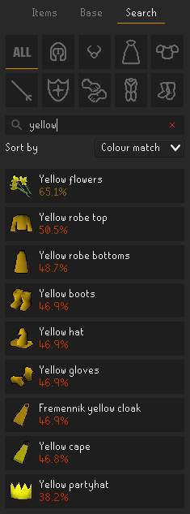

# Fashionscape

RuneLite plugin that enables cosmetic changes to your character's equipped items, base models, colours, and more.
Other players can't see the changes this plugin makes; the intention is to provide a tool for players to preview
what different combinations of models look like on them.

***Disclaimer:*** This plugin isn't intended to be on all the time. Use at your own risk in dangerous areas
of the game. Your animations may only be correct while your character is idle.

## Update 2025 August

Fashionscape v2 reworks almost all the logic behind the plugin. The UI changes are minimal, and things should
mostly behave as they did in v1. Here are some new inclusions:

* You can now "copy" your own fashionscape much like you can for other players, only you can't right-click yourself.
  Instead, **right-click the "load" button** in the side panel to clone your items and other models.
* The search panel now allows you to directly search for items by
  [item ID](https://oldschool.runescape.wiki/w/Item_IDs). Even items that don't normally display in search results may
  be equipped this way (as long as they have models/equipment slots).
* The randomizer now has a **"Cursed"** setting, which inverts the color scoring to give you the most mismatched
  combinations it can.
* The plugin no longer clears all state once it shuts down. You can safely turn it off and your setup will restore the
  next time you turn Fashionscape back on. You can also operate the plugin while you're logged out.
* Equipment slots now rely directly on data derived from the cache instead of the item stats API, which itself relies
  on RuneLite's wiki scraper: what this means for you is that there should be more options in your searches now. Many
  of these new results are unobtainable items, such as the
  [pre-update](https://oldschool.runescape.wiki/w/Torva_full_helm_(unobtainable_item))
  [Torva](https://oldschool.runescape.wiki/w/Torva_platebody_(unobtainable_item))
  [armor models](https://oldschool.runescape.wiki/w/Torva_platelegs_(unobtainable_item)).
* The "exclude non-standard items" setting has been removed. I came up with this definition myself, and I have no idea
  how to consistently apply it anymore. With new items entering the game all the time, I just can't maintain such a
  list. Apologies if you found this filter useful.
* Several long-standing bugs have been fixed, including but not limited to: the plugin conflating "not set" slots with
  "nothing" slots, several items not appearing in results, and incorrect models from weird items like the gauntlet
  legwear (which hides boots).
* A bunch of data that was previously bundled with the plugin now lives in
  a [separate repo](https://github.com/equirs/fashionscape-data). There's a chance the requests retrieving this info
  fail, but you should be able to retry any failed requests in the plugin side-panel. In some cases, GitHub might be
  down, in which case, the plugin will still work, but you may have to manually clear out some of your base models
  (you can do this by right-clicking the base model's icon). Idle animations and color matching will simply not work
  if these requests fail.

## User guide

All the UI lives in a dedicated side panel. If the plugin is on, you'll find it near the bottom of the list
(beneath notes). Look for the dress form:

The panel has a row of button controls, and below it, three tabs: outfit, base, and search.

#### Top controls

The buttons are, in order from left to right:

* Undo and redo last action (these are only enabled if you can perform them)
* A randomizer button that randomly assigns models to all your unlocked slots. The randomizer has an
  "intelligence" setting in the plugin config, which, when set to anything other than `NONE`, will utilize the colour
  matching algorithm to promote a more cohesive look.
* Save and load buttons, which work with .txt files placed in the RuneLite folder, under `/outfits/`. You can open the
  outfit folder in your system file browser by **right-clicking the save button**. Note that you can't save empty
  outfits, and anything you're actually wearing in-game isn't saved. Also, if you right-click the load button, you can
  import whatever you're wearing in-game into the plugin.
* Clear button, which undoes everything you're wearing with the plugin, **including** locked slots. If you want to erase
  everything *except* locked slots, there's a right-click option to soft clear.

#### Items tab

"Items" shows every item you're wearing via the plugin. Note that certain slots, like ammo, are not shown because no
items equipped in those slots change your appearance. Each item shows an icon that can be clicked to bring up a search
for new items in that slot. You can also "lock" and clear out each slot with the controls on the right (see
"lock mechanics" for more on locks). If nothing is set in a slot, it will display **"Not set"**, and you will see
whatever your character is actually wearing in-game. If you'd like to override what you're wearing to display nothing,
this is possible by selecting **"Nothing"** in the search results (note: this is only possible for certain item slots).

#### Base tab

"Base" is similar to "items", only this tab allows changing your character's base models and colours, essentially
combining every makeover NPC into one. The icons in this tab have a rounded border indicating the colour you've
swapped to (if you haven't changed the colour, it will show up as light gray). Note that torso+arms and hair+jaw slot
colours are connected, so changing one always changes the other. There is no search feature for these slots since there
aren't as many options; instead, **clicking the icon** brings up a dropdown to browse the colour/model options
available. Also, if you're seeing that the plugin is failing to fetch, you may **right-click the icon** to set the
model to "nothing" (this is intentionally obscure since you'll only need to do this if the plugin's requests are
failing). Right-clicking the icon a second time will toggle the model back to "not set".

If "exclude members items" is de-selected in the plugin config, there is also an option to change your character's
icon (the ones used in Barbarian Assault and Soul Wars). While these are technically items, their mechanics function
more like base models, and the UI for this slot works like all the others in "base".

#### Search tab

Here you can search for equipment to try on (by name or by [item ID](https://oldschool.runescape.wiki/w/Item_IDs)).
Leaving the search bar empty will show all the results for a selected slot (except the "all" tab, where too many results
would be displayed). The results will update as you type. Hovering over an item will show a preview of what it looks
like on your character. When clicked, the item will update and will display as part of your outfit. If the item is
already worn, clicking it again removes it. If you have locks enabled, the result text will appear grey instead of
white, and hovering over the result shows a tooltip indicating which locked slots are preventing you from equipping the
item.

There are three sorting options:

* Default, which roughly orders results by release date (it actually just goes by item IDs; close enough)
* Alphabetical, pretty self-explanatory
* Colour match, which uses aggregated, area-weighted Euclidean colour distances of the "best-matching" colours for
  that result compared to the colours of all the items currently worn (excluding the slot you're currently browsing).
  With this option selected, you can also see the colour-coded percent match for that item.

#### Lock mechanics

You can "lock" individual slots with the lock icon next to the x button for each slot in the "items" and "base" panels
(some base slots have two locks: model and colour, in that order, with the colour lock matching the current slot
colour). This prevents that slot from being cleared by the randomizer and the undo/redo function.
Clicking the lock again will unlock it. The locking feature is designed to work with the randomizer: as you find pieces
that work together, you can lock them and randomize the remaining slots. Note that locking a base model will always
lock the corresponding item slot, and unlocking an item slot will always unlock the base model. However, you can be in
a state where the item slot is locked while the base slot is unlocked.

  
Neat things you can do with locks:

* Lock the shield slot and randomize with weapons unlocked. All weapon results will be one-handed.
* Lock your player's hair/beard with the head item unlocked and randomize. All the head slot results will not obscure
  your hair and/or beard. A similar approach can be used on the player's arms model and the torso item slot.
* Lock the empty torso, legs, and/or boots item slots while leaving the base models unlocked. The randomizer will now
  scramble your base models for those slots.

#### Configuration

To view and randomize only free-to-play items, you can turn on **"exclude members items"**.

The randomizer has a few **"intelligence"** settings. Higher intelligence means the randomizer results will yield items
that are similar in colour. Lower intelligence settings are computationally faster. "Cursed" attempts to create the most
mismatched results in terms of color scoring.

There is a right-click option to **"copy-outfit"** on other players, which imports their entire look on your character,
including items, colours, and (if your genders match) base models. Since many other plugins provide player menu entries,
this feature can be toggled off.

## FAQ

Q: Isn't this hacking? Am I gonna get banned?

A: Again, other players can not see your outfits, and nothing is being sent to the server via this plugin. Using it is
not functionally affecting the game, so it's no different from other purely aesthetic plugins like resource packs.

Q: Why is it changing my character's arms / (facial) hair?

A: The client has no way of telling what your character's base models look like unless you reveal them, so
it's using some default models. The easiest fix is to un-equip your head- and torso-slot items once. You can re-equip
your items after doing this, and after you've done it once on your account, it shouldn't happen again.

Q: My animations mess up when I equip (...). Why?

Idle animations are currently the only scenario supported for now (after all, real fashionscapers are usually idle).
If you want to transmog your weapons and run around with them, I highly recommend trying out
the [weapon animation replacer](https://github.com/geheur/weapon-animation-replacer), which is also available on the
RuneLite plugin hub.

Q: Such-and-such item isn't showing up or looks janky, why?

If you notice some items look buggy or don't have the correct idle animation, please let me know by filing an issue
(note that I may take some time after a game update to fix my own data).

Feature suggestions, bug reports, and pull requests are all welcome. Please keep in mind that this plugin is intended
to be a tool for discovery and planning, and features that extend beyond that will probably not be implemented.
