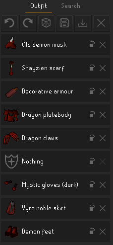

# Fashionscape
Ever spend countless hours on a grind for an untradeable item, only to realize that it doesn't look good with literally 
any other item in the game? This plugin was made for you. It allows anyone to preview combinations of equipment to 
plan out the perfect look quickly and efficiently.

## User guide
All the UI lives in a dedicated side panel for now. If the plugin is on, you'll find it near the bottom of the list
(beneath notes). Look for the dress form:
 

 
There are two tabs in this panel: outfit and search. 

"Outfit" shows everything you're wearing via the plugin and has a few controls at the top row:
* Undo and redo last action (these are only enabled if you can perform them)
* A randomizer (dice) button that randomly assigns items to all your unlocked slots
* Save and load buttons, which work with .txt files placed in the RuneLite folder, under `/outfits/`. You can open the
outfit folder in your system file browser by right-clicking either save or load. Note that you can't save empty outfits,
and anything you're actually wearing in-game isn't saved.
* Clear button, which undoes everything you're wearing with the plugin, apart from locked slots. If you want to erase
everything *including* locks, there's a right-click option to force clear.

You can "lock" individual slots with the lock icon next to the x button for that slot. This prevents that slot from 
being cleared by anything (e.g., randomizing, loading a new outfit, clearing all). Clicking the lock again will unlock
it. The locking feature is designed to work with the randomizer: as you find pieces that work together, you can lock
them and randomize the remaining slots.

The main feature of "search" is... what you expect. Leaving the search bar empty will show all the results for a selected
slot (except the "all" tab, where too many results would be displayed). The results will update as you type. Hovering
over an item will show a preview of what it looks like on your character. When clicked, the item will update and will
display as part of your outfit. If the item is already worn, clicking it again removes it.

## FAQ
Q: Isn't this hacking? Am I gonna get banned?

A: Your appearance only changes client-side; other players can't see your outfits. Using this plugin is not 
functionally affecting the game for you, it's no different from using resource packs to reskin the game's base UI.

Q: Why is it changing my character's arms / (facial) hair?

A: The RuneLite client has no way of telling what your character's base models look like unless you reveal them, so 
it's using some default models. The easiest fix is to un-equip your head- and torso-slot items.

Q: My animations mess up when I equip (...). Why?

Idle animations are currently the only scenario supported for now (after all, real fashionscapers are usually idle).
There's not an automated way to tell which animation to use for which weapon, so unless your idle animation is wrong, 
it's probably not going to be fixed anytime soon.

Q: Such-and-such item isn't showing up or looks janky, why?

A: There are several hidden / broken / unobtainable items in the game, some of which don't render correctly. If you
don't want to see these, you can go to the plugin settings and check "exclude non-standard items". This removes those 
items from search / randomize.

If you notice some items don't render your head or arms correctly, or don't have the correct idle animation, please
let me know by saving the outfit and uploading / pasting the text so I can mark that item ID appropriately.
